# Monjez Fin: AI-Powered Financial Management Suite

  

**Monjez Fin** is a sophisticated financial management ecosystem engineered specifically for freelancers and independent professionals. By merging cutting-edge **Generative AI** with real-time automation, it transforms how financial workflows are handled—from voice-to-invoice creation to automated payment reconciliation.

---

## 🌟 Key Innovation: AI Voice-to-Invoice
The core of Monjez Fin is its intelligent listening engine. Users can simply speak a natural command in Arabic (even in local dialects), and the system extracts structured data with surgical precision.

  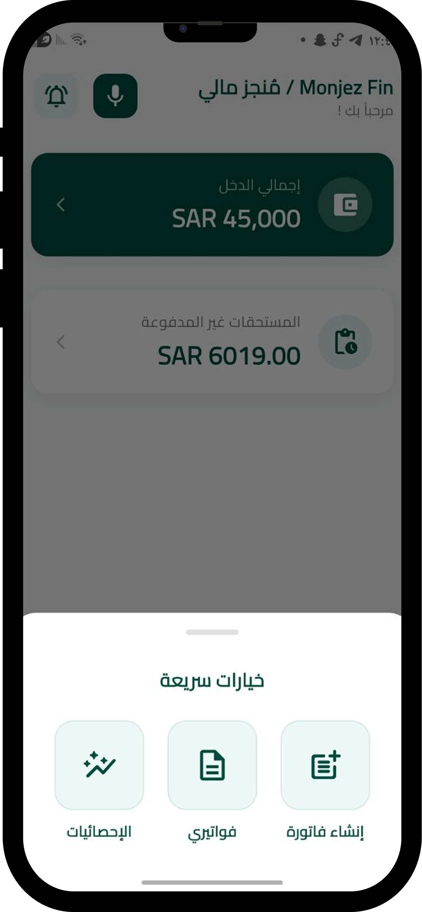
  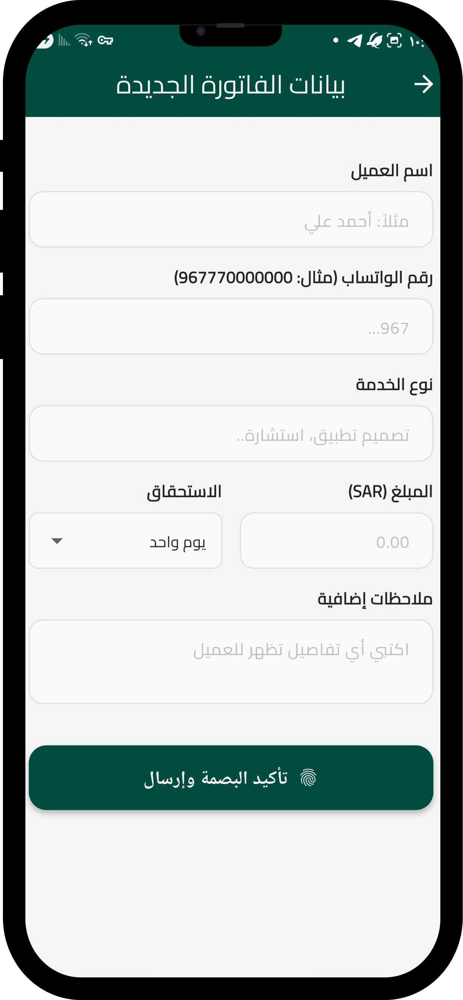

---

## 🚀 Application Workflow

### 1. Secure Onboarding & Privacy
Professional entry point featuring smooth animations and biometric-ready authentication to ensure data privacy.

  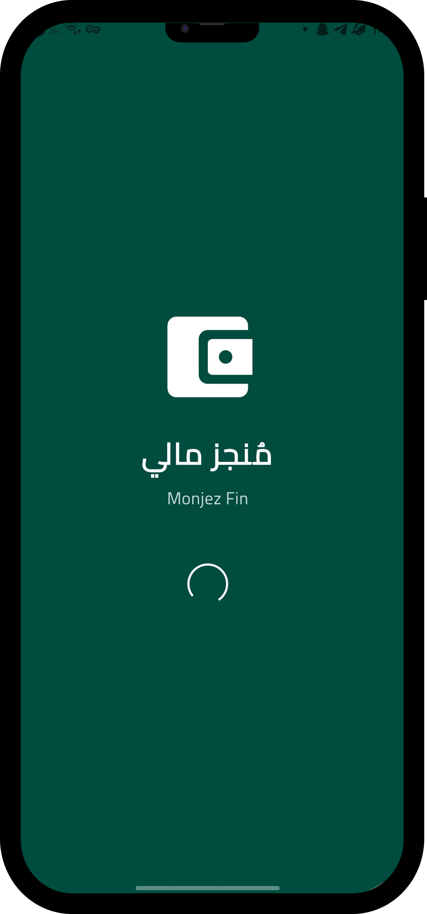
  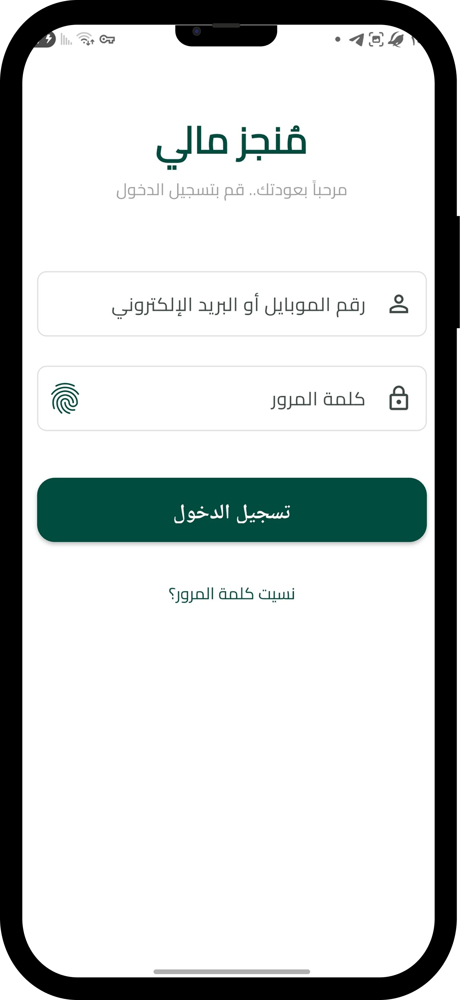
  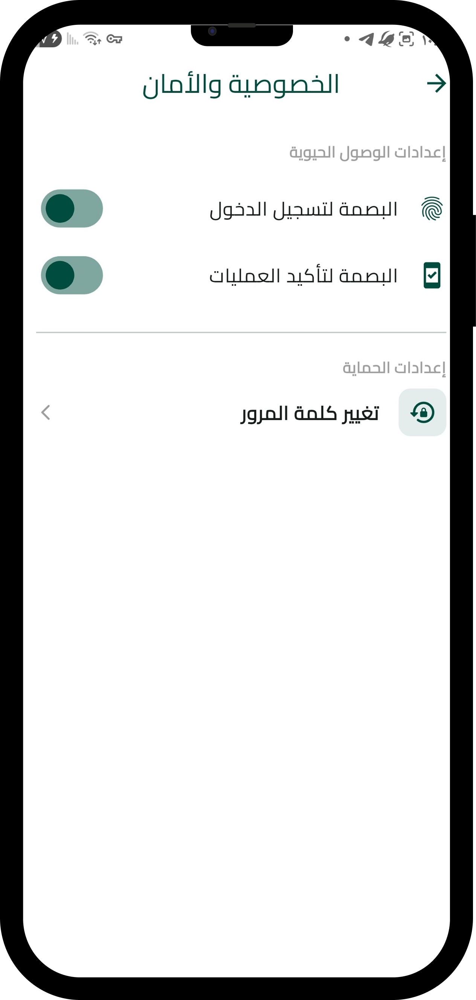

### 2. Intelligent Dashboard & Analytics
A comprehensive control center that provides a 360-degree view of your financial health.

  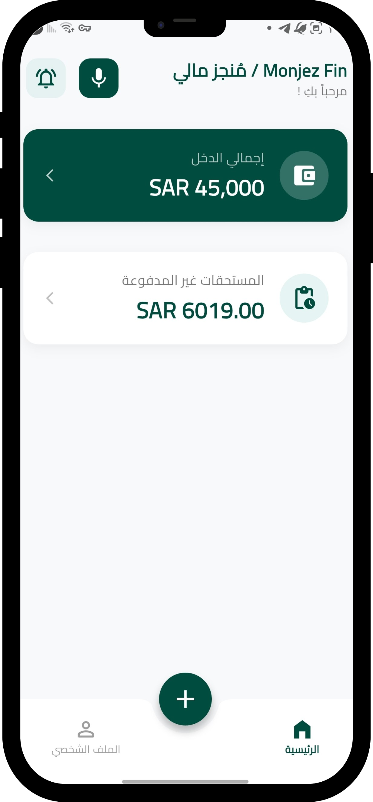
  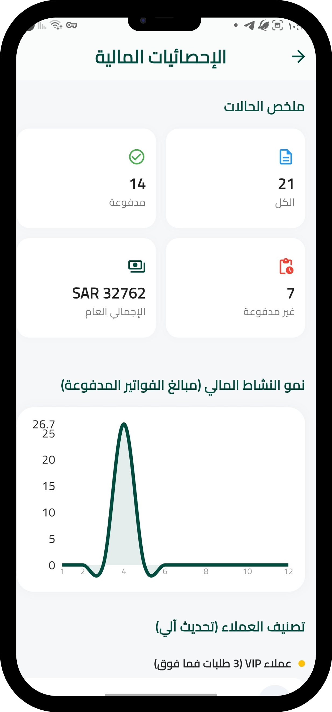
  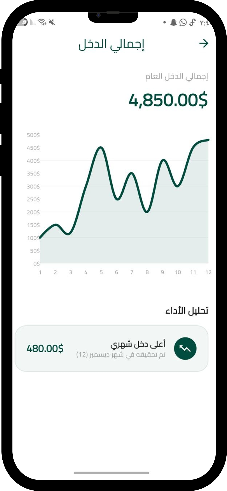

### 3. Automated Payment Cycle
Invoices are not just generated; they are tracked in real-time. Status updates are automated via Firebase Realtime Database.

| Payment Details | Success Confirmation | Notification Alerts |
|:---:|:---:|:---:|
| 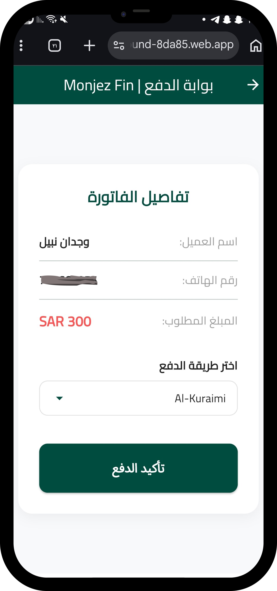 | 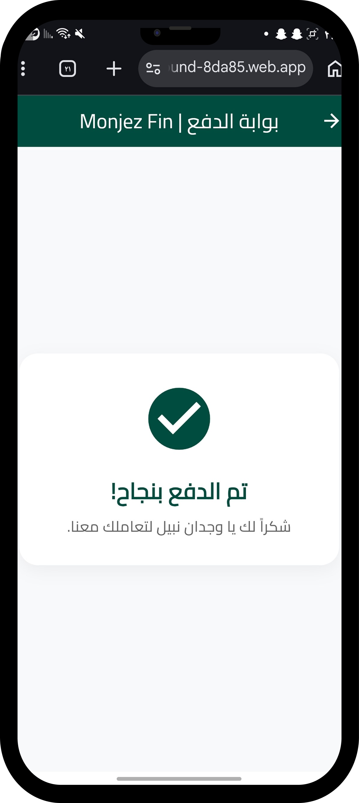 | 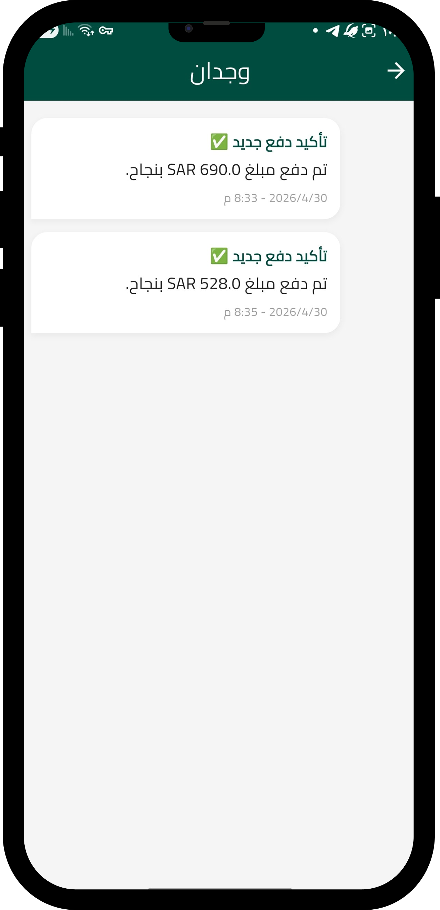 |

---

## 🛠️ Technology Stack
*   **Frontend:** Flutter & Dart
*   **Backend:** Firebase (Auth, Database, Hosting)
*   **AI Engine:** Google Gemini & Custom Local NLP
*   **Automation:** Real-time Status Sync & Smart Notifications

---

## 👥 Meet the Team
*   **Ghofran Al-shehari**
*   **Rehab Sabr**
*   **Sondos Alkenai**
*   **Areej Aljofi**

---

**Developed with ❤️ by the Monjez Fin Team**
